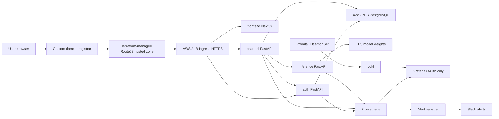

# samosaChaat EKS Defense Notes

This is the final architecture for the DevOps assignment. Production traffic is
served by EKS through Terraform-managed Route53, ACM, and ALB Ingress resources;
the repository no longer carries an EC2 deployment path.

## Architecture Diagram



## Backend Microservices

The final EKS deployment runs three backend microservices:

- `auth`: OAuth, JWT session validation, user records.
- `chat-api`: authenticated conversation API, SSE orchestration, persistence.
- `inference`: model loading, generation streaming, model swap/status APIs.

The frontend and AWS RDS database do not count toward the backend microservice
requirement. EKS uses AWS RDS PostgreSQL only; there is no Postgres Pod in the
Helm chart.

## RDS Cost-Aware Isolation

The final RDS design uses two physical AWS RDS instances:

- `samosachaat-nonprod-pg` for dev, nightly QA, and UAT, with separate logical
  databases `samosachaat_dev`, `samosachaat_qa`, and `samosachaat_uat`.
- `samosachaat-prod-pg` for production only, with database
  `samosachaat_prod`.

This is intentional: non-prod gets logical isolation by database, namespace, and
app role; prod gets physical RDS isolation. See
`docs/rds-cost-isolation-strategy.md` for the defense narrative.

Dev, QA, and UAT deploy on the non-prod cluster and use
`samosachaat-nonprod-pg`. Production uses `samosachaat-prod-pg`, which is
declared in the prod Terraform stack with Multi-AZ enabled, backups retained,
and deletion protection.

## Request Flow

1. The browser calls the Next.js frontend through `https://samosachaat.art`.
2. Frontend API routes mint or reuse `x-trace-id`, log JSON with `service=frontend`, and forward the header.
3. `chat-api` validates the bearer token by calling `auth /auth/validate` with the same `x-trace-id`.
4. `chat-api` persists the user message in RDS and calls `inference /generate` with the same `x-trace-id`.
5. `inference` streams SSE tokens back to `chat-api`; `chat-api` forwards them to the browser and persists the assistant message.

## Failure Diagnosis Workflow

1. Start in Grafana: check Node Health, Application Performance, and Inference dashboards.
2. Use the namespace/service from the panel to query Loki:

```logql
{namespace="samosachaat-prod"} | json | level="error"
{namespace="samosachaat-prod"} | json | service="auth"
{namespace="samosachaat-prod"} | json | service="chat-api"
{namespace="samosachaat-prod"} | json | service="inference"
{namespace="samosachaat-prod"} | json | trace_id="<real-trace-id>"
```

3. Confirm Kubernetes state with `kubectl get pods`, `kubectl get events`, and rollout status.
4. Apply the smallest recovery action: wait for self-healing, rollback the blue/green ingress target, or restart/scale only the failing Deployment.

## Day 2 Proof Points

- Node patching is `./scripts/rotate-nodes.sh prod --yes`; Terraform reads the latest EKS optimized AMI from SSM and managed node groups rotate nodes while PDBs preserve availability.
- Schema migrations are Helm pre-install/pre-upgrade Jobs running `alembic -c db/alembic.ini upgrade head`.
- Migration `004_add_favorited.py` is backward compatible: old pods ignore the added column, new pods read/write it after rollout.
- Prod blue/green keeps the inactive slot warm, smokes it internally, then swaps only `ingress.targetSlot`.

Proof command for node patching controls, demonstrated against UAT on the shared
non-prod infrastructure:

```bash
./scripts/rotate-nodes.sh uat --yes
```

Expected output to show during defense:

```text
No changes. Your infrastructure matches the configuration.
Deployment rolling-update settings in samosachaat-uat:
NAME        MAX_UNAVAILABLE   MAX_SURGE   AVAILABLE
auth        0                 1           2
chat-api    0                 1           2
frontend    0                 1           2
inference   0                 1           2

PodDisruptionBudgets in samosachaat-uat:
NAME        MIN AVAILABLE   ALLOWED DISRUPTIONS
auth        1               1
chat-api    1               1
frontend    1               1
inference   1               1
```

Proof command for the Helm pre-upgrade schema migration:

```bash
./scripts/demo-schema-change.sh samosachaat-uat
```

Expected output to show during defense:

```text
004_add_favorited (head)
Release "samosachaat" has been upgraded.
004_add_favorited (head)
Columns: ['id', 'user_id', 'title', 'model_tag', 'created_at', 'updated_at', 'is_favorited']
SUCCESS: is_favorited column present and migration is complete.
```
